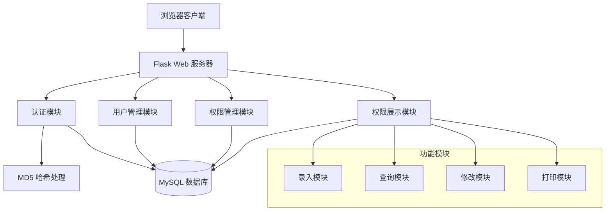

# 用户权限管理系统（消费系统）

Feature Name: user-permission-system
Updated: 2026-05-19

## Description

本系统是一个基于 Python Flask + MySQL 的 Web 应用，提供用户管理、权限管理、安全登录和权限展示功能。系统支持操作级细粒度权限控制，使用 MD5 哈希算法保护用户密码安全。

## Architecture



### 架构说明

系统采用 B/S 架构，分为三层：
- **表现层**: HTML/CSS/JavaScript 构建的 Web 界面
- **业务逻辑层**: Flask 路由处理和业务逻辑
- **数据访问层**: MySQL 数据库存储用户、权限和操作记录

## Components and Interfaces

### 1. 认证模块 (auth.py)

**职责**: 处理用户登录验证、会话管理

**接口**:
- `POST /api/login` - 用户登录
  - 请求: `{ "username": "string", "password": "string" }`
  - 响应: `{ "success": bool, "message": "string", "permissions": [...] }`
- `POST /api/logout` - 用户登出
- `GET /api/session` - 获取当前会话信息

**核心流程**:
1. 接收用户名和密码
2. 查询数据库获取用户记录
3. 对输入密码进行 MD5 哈希
4. 比对哈希值与数据库存储值
5. 验证成功则创建会话并返回权限列表

### 2. 用户管理模块 (user_mgmt.py)

**职责**: 用户的添加、删除、查询、修改

**接口**:
- `POST /api/users` - 添加用户
  - 请求: `{ "username": "string", "password": "string", "role": "admin|user" }`
  - 响应: `{ "success": bool, "user_id": int, "message": "string" }`
- `DELETE /api/users/<user_id>` - 删除用户
- `GET /api/users` - 查询所有用户
- `PUT /api/users/<user_id>` - 修改用户信息

### 3. 权限管理模块 (permission_mgmt.py)

**职责**: 权限的分配、修改、查询

**接口**:
- `POST /api/users/<user_id>/permissions` - 分配权限
  - 请求: `{ "module": "string", "operations": ["create", "read", "update", "delete", "print"] }`
  - 响应: `{ "success": bool, "message": "string" }`
- `GET /api/users/<user_id>/permissions` - 查询用户权限
- `DELETE /api/users/<user_id>/permissions` - 删除用户所有权限

### 4. 权限展示模块 (dashboard.py)

**职责**: 用户登录后展示可用权限和功能入口

**接口**:
- `GET /dashboard` - 渲染权限展示页面
- `GET /api/my-permissions` - 获取当前用户权限

## Data Models

### 用户表 (users)

| 字段 | 类型 | 约束 | 说明 |
|------|------|------|------|
| id | INT | PRIMARY KEY, AUTO_INCREMENT | 用户唯一标识 |
| username | VARCHAR(50) | UNIQUE, NOT NULL | 登录用户名 |
| password_hash | VARCHAR(32) | NOT NULL | MD5 哈希密码 |
| role | ENUM('admin', 'user') | NOT NULL, DEFAULT 'user' | 用户角色 |
| created_at | DATETIME | DEFAULT CURRENT_TIMESTAMP | 创建时间 |
| updated_at | DATETIME | DEFAULT CURRENT_TIMESTAMP ON UPDATE | 更新时间 |
| is_locked | BOOLEAN | DEFAULT FALSE | 账户锁定状态 |
| failed_attempts | INT | DEFAULT 0 | 连续登录失败次数 |

### 权限模块表 (permission_modules)

| 字段 | 类型 | 约束 | 说明 |
|------|------|------|------|
| id | INT | PRIMARY KEY, AUTO_INCREMENT | 模块唯一标识 |
| module_code | VARCHAR(50) | UNIQUE, NOT NULL | 模块代码 (entry, query, modify, print) |
| module_name | VARCHAR(100) | NOT NULL | 模块名称 |

### 操作类型表 (operation_types)

| 字段 | 类型 | 约束 | 说明 |
|------|------|------|------|
| id | INT | PRIMARY KEY, AUTO_INCREMENT | 操作唯一标识 |
| op_code | VARCHAR(50) | UNIQUE, NOT NULL | 操作代码 (create, read, update, delete, print) |
| op_name | VARCHAR(100) | NOT NULL | 操作名称 |

### 用户权限关联表 (user_permissions)

| 字段 | 类型 | 约束 | 说明 |
|------|------|------|------|
| id | INT | PRIMARY KEY, AUTO_INCREMENT | 记录唯一标识 |
| user_id | INT | FOREIGN KEY -> users.id, NOT NULL | 用户ID |
| module_id | INT | FOREIGN KEY -> permission_modules.id, NOT NULL | 模块ID |
| operation_id | INT | FOREIGN KEY -> operation_types.id, NOT NULL | 操作ID |
| UNIQUE | (user_id, module_id, operation_id) | 联合唯一约束 | 防止重复授权 |

### 数据库初始化 SQL

```sql
CREATE DATABASE IF NOT EXISTS user_permission_db 
  DEFAULT CHARACTER SET utf8mb4 
  COLLATE utf8mb4_unicode_ci;

USE user_permission_db;

-- 用户表
CREATE TABLE users (
  id INT AUTO_INCREMENT PRIMARY KEY,
  username VARCHAR(50) UNIQUE NOT NULL,
  password_hash VARCHAR(32) NOT NULL,
  role ENUM('admin', 'user') NOT NULL DEFAULT 'user',
  created_at DATETIME DEFAULT CURRENT_TIMESTAMP,
  updated_at DATETIME DEFAULT CURRENT_TIMESTAMP ON UPDATE CURRENT_TIMESTAMP,
  is_locked BOOLEAN DEFAULT FALSE,
  failed_attempts INT DEFAULT 0
);

-- 权限模块表
CREATE TABLE permission_modules (
  id INT AUTO_INCREMENT PRIMARY KEY,
  module_code VARCHAR(50) UNIQUE NOT NULL,
  module_name VARCHAR(100) NOT NULL
);

-- 操作类型表
CREATE TABLE operation_types (
  id INT AUTO_INCREMENT PRIMARY KEY,
  op_code VARCHAR(50) UNIQUE NOT NULL,
  op_name VARCHAR(100) NOT NULL
);

-- 用户权限关联表
CREATE TABLE user_permissions (
  id INT AUTO_INCREMENT PRIMARY KEY,
  user_id INT NOT NULL,
  module_id INT NOT NULL,
  operation_id INT NOT NULL,
  FOREIGN KEY (user_id) REFERENCES users(id) ON DELETE CASCADE,
  FOREIGN KEY (module_id) REFERENCES permission_modules(id) ON DELETE CASCADE,
  FOREIGN KEY (operation_id) REFERENCES operation_types(id) ON DELETE CASCADE,
  UNIQUE KEY unique_permission (user_id, module_id, operation_id)
);

-- 初始化基础数据
INSERT INTO permission_modules (module_code, module_name) VALUES
  ('entry', '录入模块'),
  ('query', '查询模块'),
  ('modify', '修改模块'),
  ('print', '打印模块');

INSERT INTO operation_types (op_code, op_name) VALUES
  ('create', '新增'),
  ('read', '查看'),
  ('update', '修改'),
  ('delete', '删除'),
  ('print', '打印');

-- 插入默认管理员账户 (密码: admin123, MD5: 0192023a7bbd73250516f069df18b500)
INSERT INTO users (username, password_hash, role) VALUES
  ('admin', '0192023a7bbd73250516f069df18b500', 'admin');
```

## Correctness Properties

### 不变量

1. **密码哈希一致性**: 数据库中存储的 password_hash 字段必须是对应明文密码的 MD5 哈希值
2. **权限唯一性**: 同一用户对同一模块的同一操作只能有一条权限记录
3. **级联删除**: 删除用户时必须同时删除该用户的所有权限记录
4. **账户锁定阈值**: 当 failed_attempts >= 3 时，is_locked 必须为 TRUE

### 前置条件

1. 用户登录前必须提供有效的用户名和密码
2. 添加用户前必须验证用户名未被占用
3. 分配权限前必须验证用户和模块存在

### 后置条件

1. 登录成功后必须返回该用户的完整权限列表
2. 添加用户成功后必须能在数据库中查询到新记录
3. 删除用户后必须无法使用被删除的凭证登录

## Error Handling

### 错误场景与处理策略

| 场景 | 错误类型 | 处理策略 |
|------|---------|---------|
| 用户名不存在 | AuthenticationError | 返回 401，提示"用户名或密码错误" |
| 密码错误 | AuthenticationError | 返回 401，提示"用户名或密码错误"，failed_attempts +1 |
| 账户已锁定 | AccountLockedError | 返回 403，提示"账户已锁定，请联系管理员" |
| 用户名重复 | DuplicateEntryError | 返回 409，提示"用户名已存在" |
| 权限不足 | PermissionDeniedError | 返回 403，提示"您没有访问该功能的权限" |
| 数据库连接失败 | DatabaseError | 返回 500，记录错误日志，提示"系统繁忙，请稍后重试" |
| 必填字段缺失 | ValidationError | 返回 400，提示具体缺失字段 |
| 会话过期 | SessionExpiredError | 返回 401，重定向到登录页面 |

### 日志记录

- 登录成功/失败事件记录到 `auth.log`
- 用户管理操作记录到 `audit.log`
- 系统异常记录到 `error.log`

## Test Strategy

### 单元测试

**认证模块测试**:
- 测试正确用户名和密码的登录流程
- 测试错误密码的拒绝逻辑
- 测试账户锁定机制（连续 3 次失败）
- 测试 MD5 哈希计算的正确性

**用户管理测试**:
- 测试添加新用户
- 测试重复用户名拒绝
- 测试删除用户及级联权限删除
- 测试修改用户信息

**权限管理测试**:
- 测试分配权限
- 测试重复权限拒绝
- 测试查询用户权限
- 测试权限删除

### 集成测试

- 测试登录到权限展示的完整流程
- 测试用户删除后权限级联删除
- 测试多用户并发登录

### 端到端测试

- 使用 Selenium 测试登录界面交互
- 测试权限不足时功能按钮禁用状态
- 测试权限展示页面的数据正确性

### 测试数据

```python
# 测试用户
test_users = [
    {"username": "admin", "password": "admin123", "role": "admin"},
    {"username": "user1", "password": "pass123", "role": "user"},
    {"username": "locked_user", "password": "pass123", "role": "user", "is_locked": True}
]

# 测试权限分配
test_permissions = [
    {"user": "user1", "module": "entry", "operations": ["create", "read"]},
    {"user": "user1", "module": "query", "operations": ["read"]},
    {"user": "admin", "module": "entry", "operations": ["create", "read", "update", "delete"]},
    {"user": "admin", "module": "query", "operations": ["create", "read", "update", "delete", "print"]},
    {"user": "admin", "module": "modify", "operations": ["create", "read", "update", "delete"]},
    {"user": "admin", "module": "print", "operations": ["read", "print"]}
]
```

## References

[^1]: (Flask 官方文档) - https://flask.palletsprojects.com/
[^2]: (PyMySQL 文档) - https://pymysql.readthedocs.io/
[^3]: (Python hashlib 文档) - https://docs.python.org/3/library/hashlib.html
